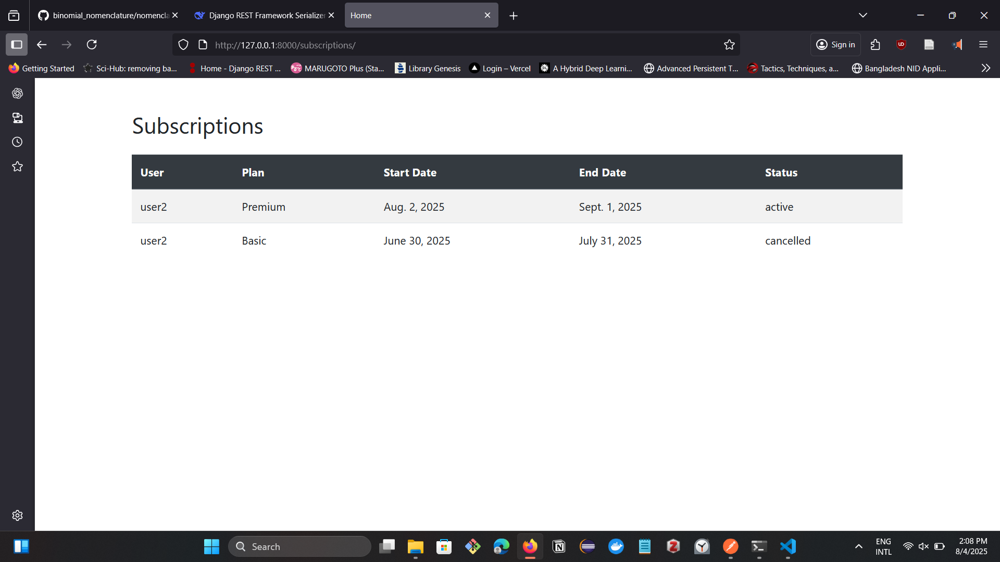

# Subscription Management System

An API based subscription management system, that is designed to manage plans, subscriptions and viewing Exchange Rates with ExchangeRate-API. A minimal backend application mande with Django Rest Framework (DRF)

---

## Setup Instructions (Local)

### 1. Clone the Repository

```bash
git clone https://github.com/rakin54/subscriptionAPI.git
cd subscriptionAPI
```

### 2. Create a Virtual Environment

```bash
python -m venv venv
source venv/Scripts/activate  # On Windows: venv\Scripts\activate
```

### 3. Install Dependencies

```bash
pip install -r requirements.txt
```

### 4. Run Migrations

```bash
python bookishfool/manage.py makemigrations
python bookishfool/manage.py migrate
```

### 5. Create Superuser (Admin)

```bash
python bookishfool/manage.py createsuperuser
```

### 6. Run the Development Server

```bash
python bookishfool/manage.py runserver
```

Make sure to create a `.env` file where you should insert your `API_KEY`. Please check `.env.example` for a sample `.env` file and replace `<your_api_key>` variable with your API Key.

---

## Overview
If the server runs successfully, type `http://127.0.0.1:8000/subscriptions/` in the address bar. It should show the interface bellow. If you have no data stored in database, it'll display "No subscrptions found" instead of data. This page served by `render()` method. Frontend - Bootstrap 4.




---

## Endpoints and Expected outcomes:

### Register a new user
`POST http://127.0.0.1:8000/api/register/`
Create a new user
Example: 
```JSON
{
    "username" : "user2",
    "email" : "user2@ex.co",
    "password" : "password"
}
```

**Output and Status Code**
- Successful request will return status `201 Created` with message 
```JSON
{
    "message": "User registered successfully!"
}
```

### Login User
`POST http://127.0.0.1:8000/api/login/`

This will allow user to Login the system. Successful credentials will generate two tokens. 
Example: 
```JSON
{
    "username":"user2",
    "password":"password"
}
```

**Output & Status Code**
- Successful login will return status code `200 OK` and will generate two tokens.
```JSON
{
    "refresh": "<refresh_token>",
    "access": "<access_token>"
}
```

*Note: for the endpoints that require authentication, `<access_token>` should be used as `Authorization` Header*

The access token will expire after 5 minutes. So, refresh token is needed for generating a new token.

### Refresh Token:
`POST http://127.0.0.1:8000/api/refresh/`
This will generate a new `<access_token>`. Following is the example:
```JSON
{
  "refresh": "<refresh_token>"
}
```
**Output & Status Code**
- Successfull response will return status code `200 OK` with a new access token.
```JSON
{
    "access": "<access_token>"
}
```


### Creates subscription

`POST http://127.0.0.1:8000/api/subscribe/`

Create a subscribtion to a plan of the service. User need to be authenticated.
Sample Input

```JSON
{
    "plan_id" : "2"
}
```

This will autometically set `start_date` to current date and `end_date` date to `start_date + Plan.duration` and status to *active*. After the `end_date` the status will autometically be set to *expired*.

*To get successful response, authentication header is required.*

`Authorization : Bearer <access_token>`

- Successful post request will return status code `201 Created` with message of the data created.
```JSON
{
    "id": 2,
    "start_date": "2025-06-30",
    "end_date": "2025-07-31",
    "status": "active",
    "user": {
        "id": 3,
        "username": "user2",
        "email": "user2@ex.co"
    },
    "plan": {
        "id": 2,
        "name": "Basic",
        "price": "3.00",
        "duration": 30
    }
}
```
- If authentication credentials not provided, then `401 Unauthorized` and message

```JSON
{
    "detail": "Authentication credentials were not provided."
}
```


Since it's JWT token-based authentication, if Token expires `401 Unauthorized` and message

```JSON
{
    "detail": "Given token not valid for any token type",
    "code": "token_not_valid",
    "messages": [
        {
            "token_class": "AccessToken",
            "token_type": "access",
            "message": "Token is expired"
        }
    ]
}
```


### View all Subscribtions
`GET http://127.0.0.1:8000/api/subscriptions/`
List all subscribtions of both past and current of the active logged in user.
This endpoint requires Authorization header like following
`Authorization: Bearer <access_token>`

**Output & Status Codes**
- Successful request will return status code `200 OK` with following information if the user is authenticated.
```JSON
[
    {
        "id": 2,
        "start_date": "2025-06-30",
        "end_date": "2025-07-31",
        "status": "active",
        "user": {
            "id": 3,
            "username": "user2",
            "email": "user2@ex.co"
        },
        "plan": {
            "id": 2,
            "name": "Basic",
            "price": "3.00",
            "duration": 30
        }
    }
]
```

- Unauthenticated users will get status `401 Unauthorized`.


### Cancel Subscribtion:
`POST http://127.0.0.1:8000/api/cancel/`

Authentication Header should be passed to execute this endpoint.
`Authorization : Bearer <auth_token>`

**Output and Status Codes:**
- Successful request returns `200 OK` with updated data.
    

``` json
{
    "id": 2,
    "start_date": "2025-06-30",
    "end_date": "2025-07-31",
    "status": "cancelled",
    "user": {
        "id": 3,
        "username": "user2",
        "email": "user2@ex.co"
    },
    "plan": {
        "id": 2,
        "name": "Basic",
        "price": "3.00",
        "duration": 30
    }
}

 ```

This is the data of the cancelled subscribtion.

- If **No active subscribtion** found, then it will return `400 Bad Request` with message
    

``` json
{
    "error" : "No Active Subscribtion Found!"
}

 ```

- For any other kind of error, it'll return `500 INTERNAL SERVER ERROR` with the error message.


### Exchange Rate Endpoints:
`GET http://127.0.0.1:8000/api/exchange-rate/?base=USD&target=BDT`

Get Currency exchange rate information using `ExchangeRate-API`.

**Output & Status Code**
- Successful Responses get status `200 OK` with following data.

```
{
    "base_currency": "USD",
    "target_currency": "BDT",
    "fetched_at": "Fri, 01 Aug 2025 00:00:02 +0000",
    "rate": 122.3321
}
```

- Missing Parameter, Invalid paramete or other errors, it will return `500 Internal Server Error` with the error message. As example like following:

```
  {
      "error": "'NoneType' object has no attribute 'upper'"
  }
```


- Longer currency code will return `400 Bad Request` with message
```
{
    "error": "Currency codes must be 3 characters long"
}
```

---

## Admin Panel and Stuff Members:

To access admin panel, type this address on browser tad: `http://127.0.0.1:8000/admin/`

For loing to the admin page, create a superuser with following command.

```bash
python bookishfool/manage.py createsuperuser
```

It will ask for username, email and password. Successful login with credentials, you will be able to login as a superuser. You can add, delete and modify plans via Django admin. This panel can't help you to modify subscribtions and exchange rate logs, only allow you to view them.

## Docker and Celery run:
Due to lack of hardware and software resources, I could not do these steps properly. I tried to work on but couldn't test them if they work or not. So, this step may not work optimally.

However, I tried to run celery on docker container. I used redis as backend and celery broker and MySQL database in containerized setup. Following are the Docker setup instruction.

Migrate database if needed with 
```bash
docker-compose run app python bookishfool/manage.py makemigrations
```
And apply migrations with
```bash
docker-compose run app python bookishfool/manage.py migrate
```

Finally run the application in dockerized environment with `docker-compose up --build` command. Celery will run in background if the compose command is up. So, to run the application in Docker container,

```bash
docker-compose up --build
```

or `docker-compose up --build -d` to run on detached mode.


**I spent 13 hours and 20 mins on this project (including bug and error handling). Including thinking time around 14 - 15 hours(Assumption)**

**What I have learned from this project:**
- Customizing admin panel permission with `admin.py` file.
- Integrating third party API with django.
- Handling multiple databases.
